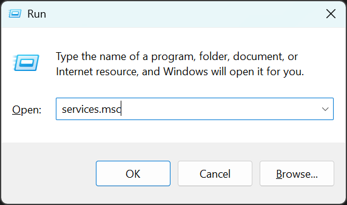
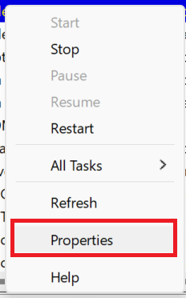

import { Steps } from '@astrojs/starlight/components';

:::note
This problem only occurs on very specific MTA servers which enabled a special detection option in the server configuration.
This kind of software **is not** prohibited on every MTA server.

If we identify more software that fits into this category, then they may be added to this detection in the future.
:::

You have been kicked for 'NetLimiter' on a server that prohibits you from running that software.

If you had to use it for unrelated purposes later in your Windows session, you can manually stop the service or end the NLsvc.exe process in task manager, or just reboot your PC, from now on.

Besides carrying out these instructions, we advise you that if you don't have a legitimate or urgent need to use this software and are also a regular visitor to this server, to save yourself hassle and uninstall it.
Please also keep in mind that a very limited selection of servers opted in to this detection, and that you're also one of a limited group of its users which are subsequently affected. Consider it a (temporary) workaround.
The admins of this server purportedly understand that NetLimiter can have benign uses, but want to avoid it being used for lag-inducing purposes.

For more information, please refer to the [MTA AC guide](https://wiki.multitheftauto.com/wiki/Anti-cheat_guide),
specifically `SD #33`.

### Solution

- Don't open the NetLimiter client while MTA is running, or while connected to a server that prohibits it.
- Prevent auto-start of the software's service (`NLsvc.exe`).

#### How to disable NetLimiter service

<Steps>
    1. Open the 'Run' window by hitting the key combination `Windows Key` + `R` at the same time.  
        Type `services.msc` into the text field and either hit `Enter` key or the `OK` button.

        

    2. Inside the new open 'Services' window:

        <Steps>
            1. Locate the item for the 'NetLimiter' service.
            2. Right-click on the item.
            3. Click on 'Properties' to open the service properties window.

                

            4. Change the 'Startup type' option to **Disabled**.

                

            5. Apply the changes and close the window.
        </Steps>

    3. Now either stop the service or reboot your computer.

    4. Try to connect to the server again without launching NetLimiter.
</Steps>
