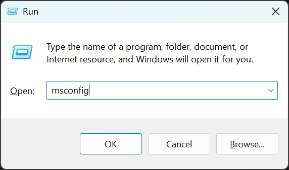
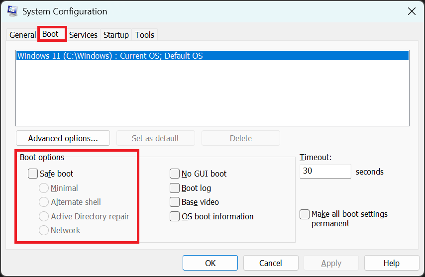

import { Steps } from '@astrojs/starlight/components';

<Steps>
    1. Reboot your computer, to boot in normal mode.

    2. Try to run Multi Theft Auto again.

    3. If that didn't work and the 'Safe Mode' error appears again,
        then you must manually change the boot mode. The next steps explain you how.

    4. Open the 'Run' window by hitting the key combination `Windows Key` + `R` at the same time.  
        Type `msconfig` into the text field and either hit `Enter` key or the `OK` button.

        

    5. Inside the new open 'System Configuration' window, switch to the 'Boot' tab, and then **remove**
        the checkmark for 'Safe Boot' for the operating system you intend to boot without Safe Boot.

        

    6. If that didn't resolve the issue, then contact MTA support.  
        Use the links at the bottom of the page to find us.
</Steps>
